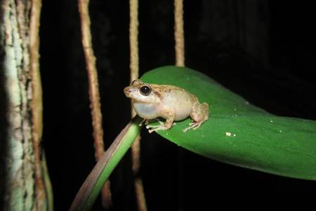

# Eleutherodactylus eileenae Chorus Analysis

## 📖 Problem Statement  
Field recordings of the Cuban tree-frog _Eleutherodactylus eileenae_ (“Colines”) capture rich nocturnal chorus behavior, but ambient noise, overlapping calls and multi-mic delays make manual analysis slow and error-prone. No Cuban study to date has combined passive acoustic monitoring with statistical interaction models to quantify how individual frogs coordinate their calling.

## 🛠️ What We Did  
1. **Noise Filtering**  
   Applied percentile-based spectral thresholds to each Mel-spectrogram, suppressing broadband (wind, traffic) and transient (other animals) noise.  
2. **Multi-Mic Synchronization**  
   Aligned nine simultaneous tracks via cross-correlation of histograms.  
3. **Heuristic Call Detection**  
   • **Energy-Based Algorithm:** Selected highest-energy events per channel.  
   • **Spectro-Temporal Clustering:** Grouped local spectrogram peaks into CO/LIN pairs via agglomerative clustering.  
4. **Interaction Modeling**  
   Mapped each frog’s call series to binary “spin” states and inferred pairwise couplings \(J_{ij}\) using an exact maximum-likelihood Ising framework.

## 📊 Key Results  
- **Detection Performance:** Clustering outperformed energy-thresholding when chorusing activity was sparse; both algorithms achieved near-identical timing (9/9 microphones, \(R^2 \ge 0.99\)).  
- **Interaction Inference:** The Ising model revealed a handful of significant couplings, but a simpler independent‐spin model better predicted call‐patterns, suggesting either weak acoustic interactions or limits of the equilibrium assumption.

## 🏁 Conclusions  
Our fully automated pipeline delivers reproducible call‐detection and quantifies chorus coordination in _E. eileenae_. Although the standard Ising formulation showed limited predictive power, our approach lays the groundwork for scalable ecoacoustic studies and points toward dynamic, non-equilibrium models to capture frog chorus behavior more faithfully.

